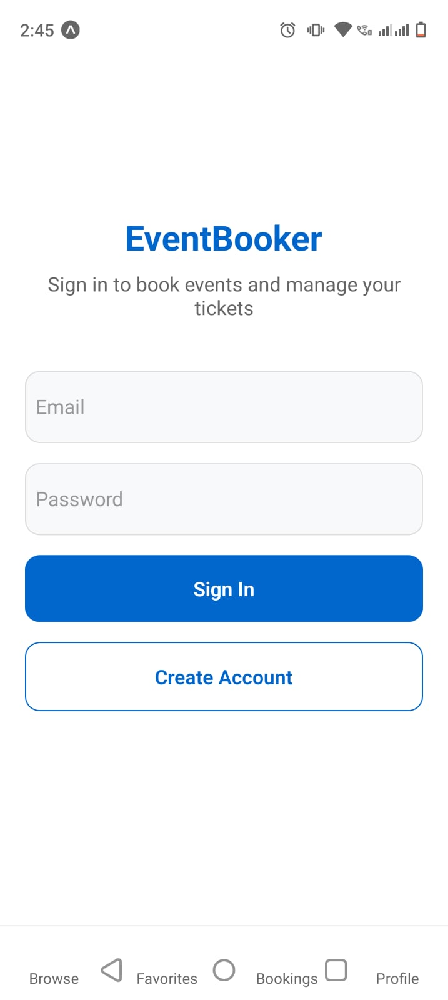
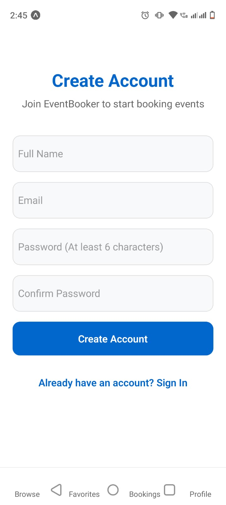
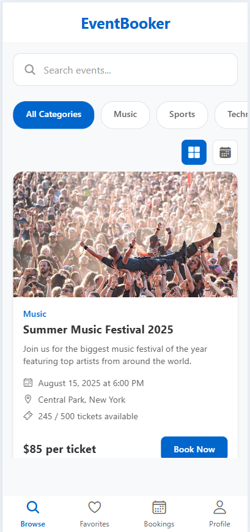
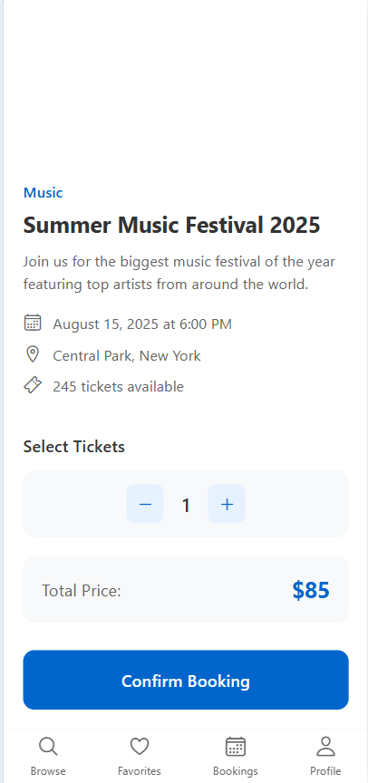
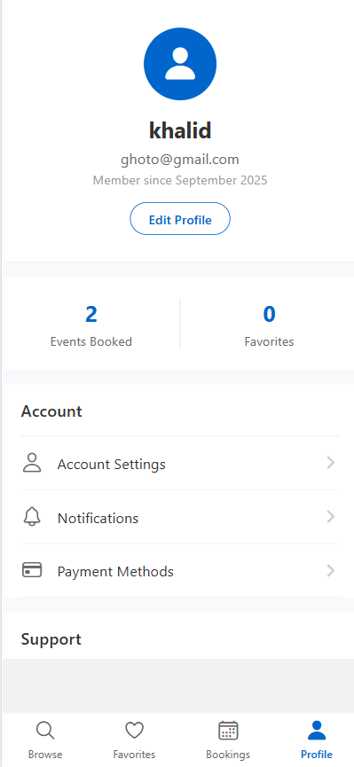

# 🎟️ EventBooker App

A modern and user-friendly **Event Booking Application** built with React Native / Expo.  
Easily browse, search, and book tickets for **music concerts, sports events, technology talks, food festivals, art exhibitions, and business seminars**.  

---

## 🚀 Features
- 🔍 Search and filter events by category  
- 🎶 Music, 🎨 Art, 🏀 Sports, 🍔 Food, 💼 Business, and 💻 Technology events  
- 📅 Event details with date, venue, and availability  
- 🎟️ Real-time ticket availability  
- 💳 Easy booking interface  
- 📱 Modern UI with smooth navigation  

---

## 📸 Screenshots

### Event Browsing

---

## 🛠️ Tech Stack
- **React Native / Expo**
- **React Navigation**
- **TailwindCSS (NativeWind)** for styling
- **Icons** (e.g., Ionicons, Lucide)

---
